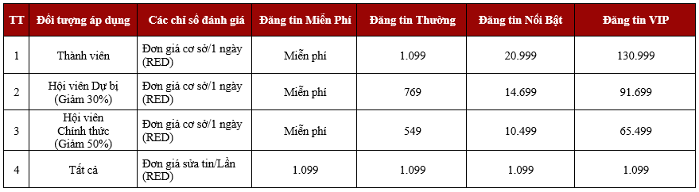
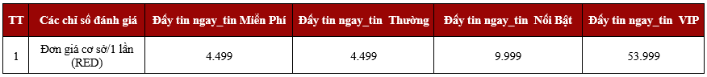

# 💡 Chính sách giá tin đăng

I. Đối tượng áp dụng và phạm vi áp dụng

* **Đối tượng áp dụng**: Áp dụng cho toàn bộ khách hàng sử dụng các tính năng Đăng tin, Đẩy tin, Đổi gói tin trên các nền tảng App/ Web thuộc hệ sinh thái VARs Connect.
* **Đối tượng “Thành viên”**: Là người dùng đã có tài khoản Cá nhân và/hoặc tài khoản Doanh nghiệp trên VARs Connect.
* **Đối tượng “Hội viên dự bị”**: Là đối tượng Hội viên trên VARs Connect nhưng chưa được duyệt hoàn tất hồ sơ Hội viên.
* **Đối tượng “Hội viên chính thức”**: Là Thành viên đã thực hiện “Đăng ký Hội viên Hội Môi giới Bất động sản Việt Nam” thành công trên VARs Connect.
* **Phạm vi, thời gian áp dụng**: Toàn quốc từ ngày ra mắt sản phẩm.


[Broken link](broken-reference)


## II. Chính sách sản phẩm và giá bán&#x20;

### **1. Chính sách Đăng tin và sửa tin**

**Gói Đăng tin** bao gồm 04 gói: Đăng tin Miễn Phí, Đăng tin Thường, Đăng tin Nổi Bật và Đăng tin VIP.

**Gói sửa tin** cho phép tất cả các đối tượng sửa tin đăng với cùng đơn giá 1.099 RED áp dụng cho tất cả các loại tin đăng.

<figure><figcaption>
Bảng giá các gói Đăng tin và sửa tin
</figcaption></figure>

<figure><figcaption>
Bảng kỹ thuật gói Đăng tin
</figcaption></figure>

### 2. Chính sách Đẩy tin

Chính sách Đẩy tin bao gồm 02 gói: Đẩy tin ngay và Đẩy tin linh hoạt. Trong đó, gói Đẩy tin ngay chia thành 04 loại và gói Đẩy tin linh hoạt chia thành 03 loại dựa trên các gói đăng tin.&#x20;

Gói Đẩy tin không phân biệt đối tượng Thành viên/Hội viên.

<figure><figcaption>
Bảng giá gói Đẩy tin ngay
</figcaption></figure>

<figure><figcaption>
Bảng giá gói Đẩy tin linh hoạt
</figcaption></figure>

<figure><figcaption>
Bảng kỹ thuật gói Đẩy tin
</figcaption></figure>

### 3. Chính sách đổi gói tin&#x20;

Chính sách đổi gói tin cho phép tất cả các đối tượng đổi tin đăng hiện tại sang gói tin mới phù hợp nhu cầu. Việc đổi gói tin sẽ hủy gói tin hiện tại và không hoàn lại RED cho gói đã hủy, đồng thời chuyển tin đăng sang gói mới.&#x20;

Không cho phép đổi từ gói hiện tại sang gói tin Miễn Phí.

<figure><figcaption>
Bảng giá đổi gói tin
</figcaption></figure>

<figure><figcaption>
Bảng kỹ thuật đổi gói tin
</figcaption></figure>
