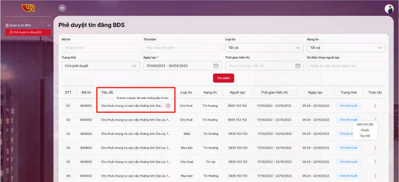

# 💡 Quy trình kiểm duyệt và quản lý nội dung tin đăng của Ban quản trị

Khi Thành viên tiến hành đăng tin lên Sàn, Ban quản trị sẽ có bộ phận kiểm duyệt nội dung, bộ phận này tiến hành kiểm tra nội dung đăng tải của Thành viên. Tất cả những tin đăng vi phạm nội quy đăng tin được quy định tại mục [<mark style="color:red;">**Quy định đăng tin**</mark>](../quy-dinh-chung/quy-dinh-dang-tin.md) tại Quy chế này đều sẽ không được duyệt hiển thị.

Đối với việc kiểm duyệt thông tin Thành viên phản ánh, công ty sẽ tiến hành liên hệ trực tiếp đến người phản ánh để xác thực thông tin.

Khi phát hiện thông tin đăng tải về BĐS có vi phạm quy chế hoạt động của VARs Connect, Bộ phận kiểm duyệt nội dung sẽ tiến hành xử lý theo Quy định đăng tin tại Quy chế này.

### Quy trình kiểm duyệt tin đăng

**Bước 1**: Người duyệt tin truy cập và đăng nhập vào website: [_http://management.varsland.vn_](http://managemant.varsland.vn)  để tiến hành phê duyệt tin đăng.

<figure><figcaption></figcaption></figure>

**Bước 2**: Tại thư mục Quản lý tin đăng BĐS, Người duyệt tin nhấn chọn mục Phê duyệt tin đăng BĐS, sau đó tại tiểu mục Trạng thái nhấn chọn tiêu chí lọc “Chờ phê duyệt” và bấm “Tìm kiếm” để lọc ra các tin đăng chờ phê duyệt.

<figure><figcaption></figcaption></figure>

**Bước 3**: Tại màn hình kết quả tìm kiếm các tin chờ phê duyệt, hệ thống sẽ quét tự động nội dung các tin đăng và cảnh báo nếu tin đăng có từ khóa có khả năng vi phạm, cuối mỗi tiêu đề tin đăng có nội dung vi phạm sẽ có biểu tượng cảnh báo (dấu chấm thang đỏ), bấm vào Dấu chấm thang đỏ sẽ hiển thị danh sách các từ khóa vi phạm trong tin đăng.

<figure><figcaption></figcaption></figure>

**Bước 4**: Tại màn hình kết quả tìm kiếm các tin chờ phê duyệt, Người kiểm duyệt nhấn chọn vào cột **Thao tác** của Tin cần duyệt và chọn **Xem chi tiết** để kiểm duyệt lại nội dung và các từ khóa vi phạm có trong tin đăng trước khi quyết định **Phê duyệt** hoặc **Từ chối** tin đăng.

<figure><figcaption></figcaption></figure>

**Bước 5**: Người kiểm duyệt xem xét và nhấn chọn vào mục Duyệt để xuất bản nếu tin đăng có nội dung đúng quy định.

<figure><figcaption></figcaption></figure>

Trường hợp tin đăng chưa đúng quy định, người kiểm duyệt sẽ từ chối đăng tin bằng cách nhấn chọn vào mục “Từ chối” và gửi thông báo đến người đăng tin lý do từ chối. Tin đăng bị từ chối sẽ được chuyển sang trạng thái “Bị từ chối”.

<figure><figcaption></figcaption></figure>

<figure><figcaption></figcaption></figure>

**Thời gian duyệt tin:**

\+ Tin Miễn Phí: Kiểm duyệt trong vòng 24 giờ.

\+ Tin Thường: Kiểm duyệt trong vòng 1 giờ.

\+ Tin Nổi Bật: Kiểm duyệt trong vòng 30 phút.

\+ Tin VIP: Tin VIP được ưu tiên hiển thị ngay và được kiểm duyệt trong vòng 05 phút kể từ lúc hiển thị.

Khung giờ trên được quy định trong trường hợp tin đăng của khách hàng không vi phạm các quy chuẩn tin đăng của Quy chế hoạt động hay các quy định sử dụng khác.

**Bước 6**: Đối với các tin đăng được nhấn chọn **Duyệt**, màn hình sẽ xuất hiện yêu cầu xác nhận duyệt tin. Người duyệt tin nhấn chọn **Xác nhận** để hoàn thành việc duyệt tin đăng.

<figure><figcaption></figcaption></figure>

**Hình ảnh hiển thị trên Ứng dụng sau khi các tin đăng được phê duyệt:**

<figure><figcaption></figcaption></figure>
